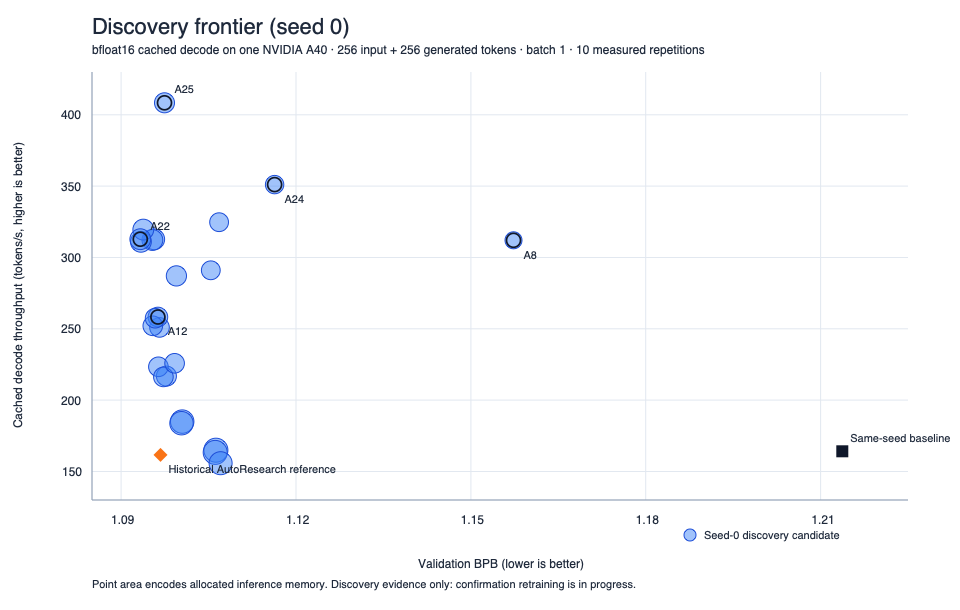
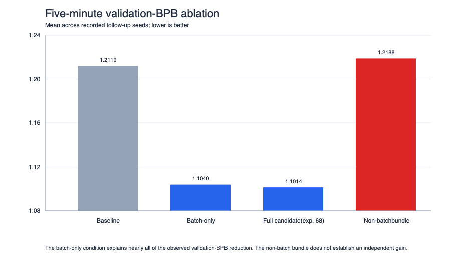
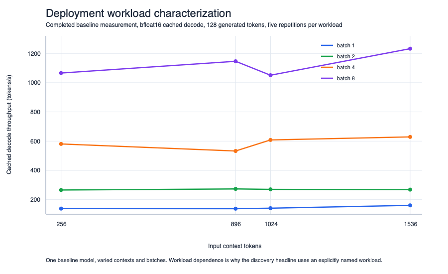

# AutoPareto

AutoPareto is a controlled autonomous research loop for Transformer architecture and training configuration search. For each attempt, it mutates a candidate, retrains from scratch under a fixed budget, runs protected cached-inference evaluation, and selects on validation BPB, cached decode throughput, allocated GPU memory, and parameter count. In the seed-0 discovery campaign, a 26.2M-parameter candidate reached **1.0974 validation BPB, 408.4 cached tokens/s, and 141.4 MiB allocated GPU memory**, versus the same-seed 50.3M-parameter baseline at 1.2137 BPB, 164.1 tokens/s, and 249.9 MiB: **9.6% lower validation BPB, 2.49× throughput, 43.4% less memory, and 47.9% fewer parameters**. These are discovery measurements, not a confirmed frontier.

Against the strongest cached-inference-compatible historical AutoResearch reference, the same candidate has near-identical validation BPB, 1.0974 versus 1.0968, at **2.53× cached decode throughput and 43.4% less allocated GPU memory**. The reference is a historical seed-42 run rather than a same-seed comparison; both use the headline bfloat16 A40 cached-decode workload below.

**Headline measurement conditions:** one NVIDIA A40; bfloat16; cached decode; 256 input tokens; 256 generated tokens; batch size 1; 10 measured repetitions. Validation BPB is measured after 300 training seconds from scratch.

*Discovery frontier (confirmation retraining in progress). Seed-0 candidates are plotted as discovery evidence. Point area encodes allocated inference memory. The same-seed baseline and the historical compatible AutoResearch reference are marked.*

## Method

Each AutoPareto campaign follows this loop:

1. Read the campaign's prior results and current Pareto frontier.
2. Select a valid non-dominated parent.
3. State one hypothesis.
4. Make one candidate source change.
5. Retrain from scratch for the fixed budget.
6. Run protected cached-inference evaluation.
7. Record metrics, source and evaluator hashes, parentage, failures, and the agent's decision.
8. Update the Pareto frontier before the next proposal.

Discovery conditions are fixed: one NVIDIA A40, bfloat16, 300 measured training seconds per attempt, 25 attempts per campaign, three completed AutoPareto campaigns at seeds 42, 0, and 1, and a same-seed baseline alongside each campaign. Validation BPB is minimized; cached decode throughput is maximized; peak allocated CUDA memory is minimized; parameter count is recorded for interpretation. Crashes, OOMs, timeouts, cache incompatibilities, and protection failures consume an attempt. Campaigns are isolated from one another.

Cached-generation correctness is a gate, not an objective. A candidate that does not pass the cache check cannot contribute a speed or memory result. See [the protocol](protocol/research_protocol.md) and [ledger schema](protocol/ledger_schema.md).

## Discovery results

All tables in this section are **discovery evidence**. Throughput and memory use the headline A40/bfloat16/cached-decode workload stated above.

### Same-seed baselines

| Training seed | Validation BPB | Cached decode, tok/s | Allocated memory, MiB | Parameters |
|---:|---:|---:|---:|---:|
| 0 | 1.2137 | 164.1 | 249.9 | 50.33M |
| 1 | 1.2189 | 151.9 | 249.9 | 50.33M |
| 42 | 1.1893 | 157.3 | 249.9 | 50.33M |

### Seed 0

| Candidate | Selection or interpretation | Validation BPB | Cached decode, tok/s | Allocated memory, MiB | Parameters |
|---|---|---:|---:|---:|---:|
| A25 | Fastest within the 1% validation-BPB threshold | 1.0974 | 408.4 | 141.4 | 26.21M |
| A22 | Lowest validation BPB in this campaign | 1.0933 | 312.8 | 159.9 | 29.36M |
| A12 | Lowest memory within the 1% validation-BPB threshold | 1.0963 | 258.3 | 132.2 | 24.58M |
| A24 | Largest exclusive hypervolume contribution | 1.1163 | 351.1 | 105.2 | 17.89M |
| A8 | Low-memory boundary, outside the 1% validation-BPB threshold | 1.1573 | 312.0 | 80.5 | 11.53M |

The A25 comparison in the opening paragraph is against the **seed-0 baseline** in the first table. It is not a cross-seed average.

### Seed 1 replicate

| Candidate | Selection or interpretation | Validation BPB | Cached decode, tok/s | Allocated memory, MiB | Parameters |
|---|---|---:|---:|---:|---:|
| A25 | Lowest validation BPB in this campaign | 1.0958 | 253.7 | 132.2 | 24.58M |
| A21 | Fastest within the 1% validation-BPB threshold | 1.0967 | 257.1 | 132.2 | 24.58M |
| A10 | Lowest memory within the 1% validation-BPB threshold | 1.1061 | 249.2 | 113.3 | 17.30M |
| A15 | Efficiency boundary | 1.3428 | 534.8 | 49.8 | 3.54M |
| A16 | Degradation boundary, not a usable model at this validation-BPB level | 1.5015 | 1,073.0 | 48.6 | 3.34M |

The 3.34M A16 point maps where aggressive efficiency causes severe validation degradation. It is not presented as a deployment candidate.

### Seed 42: earlier evaluator revision, discovery evidence only

The seed-42 campaign underwent evaluator revisions while cached-generation correctness was repaired. Its candidate records are retained as discovery evidence, but are not pooled as equivalent to seed 0 and seed 1 final-evaluator measurements.

| Candidate | Selection or interpretation | Validation BPB | Cached decode, tok/s | Allocated memory, MiB | Parameters |
|---|---|---:|---:|---:|---:|
| A22 | Lowest validation BPB in this campaign | 1.0940 | 151.3 | 249.9 | 50.33M |
| A14 | Validation-BPB and efficiency balance | 1.0971 | 177.1 | 203.1 | 36.96M |
| A21 | KV-shared intermediate point | 1.1004 | 178.2 | 189.0 | 31.85M |
| A15 | Efficiency point | 1.1120 | 207.3 | 122.4 | 18.87M |
| A16 | Primary efficiency point | 1.1228 | 242.2 | 113.3 | 17.30M |
| A17 | Fastest/smallest in this campaign | 1.1811 | 302.4 | 74.5 | 9.18M |

## Findings

### 1. Shallower architectures repeatedly shifted the serving trade-off

Across discovery campaigns, reducing depth often lowered allocated memory and increased cached decode throughput, at a validation-BPB cost that varied by candidate. A relatively isolated seed-42 change from depth 8 to 7 at width 512 measured 13.9% more cached decode throughput and 7.6% less allocated memory for 0.06% higher validation BPB. Compound changes are treated as observations, not isolated causal effects.

### 2. Compact candidates retained near-reference validation BPB in the fixed-budget regime

The seed-0 A25 candidate has 26.21M parameters, 1.0974 validation BPB, 408.4 cached tokens/s, and 141.4 MiB allocated memory. The historical compatible AutoResearch reference has 50.33M parameters, 1.0968 BPB, 161.6 tokens/s, and 249.9 MiB. This is a discovery comparison under the same headline inference workload, not a same-seed confirmation result.

### 3. Smaller training batch, not the architecture bundle, drove most of the five-minute validation gain

The preregistered ablation used three paired seeds for the follow-up conditions. Lower is better for validation BPB.

| Condition | Mean validation BPB | Mean paired change versus baseline |
|---|---:|---:|
| Baseline | 1.2119 | — |
| Batch-only, total batch \(2^{17}\) | 1.1040 | 0.1126 lower BPB |
| Full selected candidate, experiment 68 | 1.1014 | 0.1151 lower BPB |
| Non-batch architecture/training bundle | 1.2188 | 0.0023 higher BPB |

The smaller batch, not the architecture bundle, drove most of the five-minute validation-BPB reduction. The architecture bundle did not independently establish a validation-BPB gain in this ablation. This result concerns finite-time validation BPB; it does not imply an inference-speed effect because the batch-only condition does not change the inference graph.

### 4. KV-head sharing reduced memory and parameters; speed effects were not consistently established

The discovery records support memory and parameter savings from KV-head sharing. They do not establish a consistent cached-decode speed effect across campaigns. The project therefore treats the memory effect as the supported finding and does not present KV sharing as a reliable speed optimization.

### 5. Throughput is workload-dependent

Deployment characterization was run with context lengths 256, 896, 1,024, and 1,536; batch sizes 1, 2, 4, and 8; 128 generated tokens; one warm-up and five measured repetitions. It records prefill latency, decode throughput, allocated and reserved memory, KV-cache growth, and correctness. The measured speed ratio varies by context and batch size, so the headline batch-1 result must not be generalized to all serving workloads.

## Classical-search controls

The following seed-42 controls used the same A40, fixed 300-second training duration, 25-attempt budget, and frozen classical search space. Values use the headline bfloat16 cached-decode workload. OOMs were counted against the attempt budget.

| Method | Selected result | Validation BPB | Cached decode, tok/s | Allocated memory, MiB |
|---|---|---:|---:|---:|
| Random Search | Lowest validation BPB | 1.1038 | 204.6 | 179.9 |
| TPE | Lowest validation BPB | 1.0977 | 212.3 | 204.9 |
| CMA-ES | Lowest validation BPB | 1.1083 | 174.7 | 131.1 |
| MOTPE | Lowest validation BPB | 1.0981 | 226.1 | 142.7 |
| NSGA-II | Lowest validation BPB | 1.1077 | 166.1 | 249.9 |

AutoPareto edited arbitrary candidate code, whereas the classical methods searched a frozen configuration space, and these control campaigns have completed for one seed only. They are evidence that AutoPareto found stronger practical candidates in this setup, not a universal claim about autonomous agents versus TPE, CMA-ES, MOTPE, or NSGA-II. The MOTPE configurations, logs, and metrics are retained, but its checkpoints were lost through a historical temporary-directory/symlink incident; selected MOTPE candidates must be retrained before downstream or quantization work.

## Status and limitations

- **Discovery evidence:** three 25-attempt AutoPareto campaigns are complete. The release includes 284 experiment records, 302 training runs, and 3,017 inference-plus-deployment measurement rows.
- **Confirmation retraining:** not complete. The frozen plan retrains four seed-0 candidates, A12, A22, A24, and A25, across seeds 0, 1, and 2 for 12 runs total.
- **Confirmed frontier:** empty. No discovery candidate is presented as a confirmed Pareto-frontier result.
- **Downstream evaluation:** frozen but unrun. The suite contains held-out ClimbMix, LAMBADA, BLiMP, PIQA, and ARC-Easy.
- **Quantization:** specified but unrun. The planned protocol includes a bfloat16 reference and INT8 weight-only evaluation, with INT4 only if an A40-compatible kernel is verified.
- **Scale transfer:** untested beyond approximately 15M to 50M parameters and the 300-second training budget.
- **Classical controls:** cross-seed controls for seeds 0 and 1 are registered but unrun.
- **Seed 42:** evaluator revisions during cache-correctness repair mean its results are discovery-only and are separately labeled above.

Full agent and search code will be released with the paper. Targeting a NeurIPS submission.

## Repository contents

| Path | Contents |
|---|---|
| [`data/`](data/) | CSV exports for experiment records, repeated inference measurements, and deployment measurements. |
| [`configs/`](configs/) | Exact named-candidate configuration snapshots with source hashes. |
| [`plots/`](plots/) | SVG and PNG versions of the released plots. |
| [`protocol/`](protocol/) | Protocol and public ledger-schema description. |
