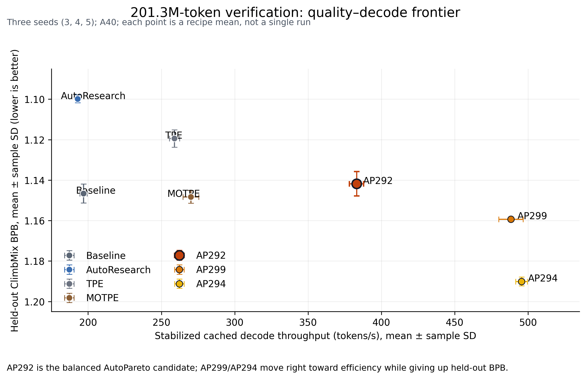

# AutoPareto

AutoPareto is an auditable autonomous research loop for discovering language-model
training recipes on a quality–inference-speed–memory Pareto frontier.

## Research question

Can an autonomous coding agent discover substantially smaller, faster, lower-memory
language-model recipes while preserving useful language quality under a fixed training
budget?

## Current headline result

The safest result to show today is the equal-token AP292 verification. At exactly
`201,326,592` training tokens on an NVIDIA A40, AutoPareto 292 averaged across seeds
3–5:

- 29.36M parameters;
- 385.019 s steady-state-equivalent training time and 522,900.35 training tokens/s;
- 383.02 cached decode tokens/s;
- 1.141837 held-out BPB.

The equal-size AutoResearch reference averaged 50.33M parameters, 696.163 s,
289,194.67 training tokens/s, 192.933 cached decode tokens/s, and 1.099803 held-out BPB.
Thus AP292 is materially smaller and faster, but it gives up held-out BPB. This is an
efficiency–quality trade-off, not evidence that AutoPareto universally beats
AutoResearch.



*Figure 1. Means ± sample SD across seeds 3–5. Lower held-out BPB and higher cached
decode throughput are better. AP292 is highlighted as the current balanced candidate;
AP299 and AP294 are more aggressive efficiency points.*

## What the autonomous agent did

The agent edited candidate training programs, trained each candidate, measured
validation quality, protected cached inference speed and memory, recorded a hypothesis
and decision, and retained or rejected candidates using a three-objective Pareto rule.
It searched architecture, attention layout, optimizer/schedule, and batching choices
under a fixed five-minute discovery budget. The agent did not see downstream benchmark
results during search; those were frozen for post-search characterization.

The research workspace preserves candidate code, experiment lineage, checkpoints,
failures, evaluator hashes, and raw measurements. This public branch intentionally
packages the reproducibility code, aggregate results, and documentation without
publishing checkpoint weights, databases, raw logs, or private caches.

## Two evidence phases

### 1. Five-minute discovery campaign

AutoPareto, AutoResearch, and classical controls searched the small model space under
the original five-minute training budget. This phase discovered distinct quality,
speed, and memory recipes, including AP292, AP299, and AP294. The original downstream
panel evaluated 11 selected representatives with the frozen suite: 99 aggregate task
metrics and 198 fixed qualitative generations.

These are historical discovery/selection results. They are not equal-token comparisons
because model size and tokens processed varied during the five-minute budget.

### 2. Equal-token verification

Seven frozen recipes—Baseline, AutoResearch, TPE, MOTPE, AP292, AP299, and AP294—were
trained for exactly `201,326,592` tokens at seeds 3, 4, and 5. All 21 runs completed.
The same frozen downstream suite was then run on all 21 checkpoints. The full results
are in [docs/PHASE1_200M_RESULTS.md](docs/PHASE1_200M_RESULTS.md), with protocol details
in [docs/DOWNSTREAM_EVALUATION.md](docs/DOWNSTREAM_EVALUATION.md).

## Equal-token verification summary

Means across seeds 3–5; SDs and all per-seed values are in the full Phase 1 report.

| Model | Params | Held-out BPB ↓ | Steady training s ↓ | Train tok/s ↑ | Cached decode tok/s ↑ | ARC-Easy ↑ | PIQA ↑ | LAMBADA EM ↑ | BLiMP ↑ |
|---|---:|---:|---:|---:|---:|---:|---:|---:|---:|
| Baseline | 50.33M | 1.146590 | 688.500 | 292,413 | 196.821 | 35.28% | 57.36% | 20.47% | 71.37% |
| AutoResearch | 50.33M | **1.099803** | 696.163 | 289,195 | 192.933 | 36.50% | 58.67% | 20.44% | **74.56%** |
| TPE | 39.85M | 1.119402 | 540.526 | 372,464 | 258.894 | 35.70% | 57.64% | 21.42% | 73.30% |
| MOTPE | 26.35M | 1.148253 | 398.233 | 505,550 | 270.006 | 35.41% | 57.45% | 21.53% | 72.47% |
| **AutoPareto 292** | **29.36M** | 1.141837 | **385.019** | **522,900** | **383.022** | **36.91%** | **58.29%** | **21.50%** | 72.02% |
| AutoPareto 299 | 26.21M | 1.159309 | 312.785 | 643,659 | 488.258 | 35.68% | 57.27% | 20.76% | 70.47% |
| AutoPareto 294 | 17.89M | 1.190057 | 295.683 | 681,101 | 495.491 | 34.83% | 56.91% | 19.92% | 69.33% |

AP292 is smaller and much faster than AutoResearch. Relative to AutoResearch, its
observed ARC-Easy, PIQA, and LAMBADA results are close, while held-out BPB and BLiMP
are worse. LAMBADA perplexity is a separate lower-is-better metric: AP292 is 14.2085
versus AutoResearch at 14.1518. No combined downstream quality score is used.

## Current status

### Complete

- Three AutoPareto discovery campaigns and the historical five-minute comparison panel.
- Multi-seed AutoPareto confirmation and causal ablation records.
- Classical-search controls under the registered small-model search space.
- The 21-run equal-token verification campaign at exactly 201,326,592 tokens.
- The frozen nine-metric downstream suite on all 21 equal-token checkpoints.
- A40 cached-inference, training-time, memory, KV-cache, and stabilized decode records.
- Raw JSON, SQLite provenance, checkpoint/candidate hashes, and failure history.

### Verified

- AP292 is a reproducible efficiency point across seeds 3–5: 383.02 ± 4.90 cached
  decode tok/s, 1.141837 ± 0.006035 held-out BPB, and 1.992 MiB incremental KV memory.
- AP299 and AP294 extend the throughput/memory frontier, with progressively worse
  held-out BPB and downstream quality.
- AutoResearch remains the strongest measured quality reference on held-out BPB and
  BLiMP in the equal-token panel.

### Still uncertain

- Which AP292 changes are causal after controlling for architecture/depth, parameter
  count, and the remaining optimizer/schedule differences. AP292 and AutoResearch
  already share total batch size 131,072, device batch size 64, and gradient
  accumulation 1 in the equal-token verification, so batch size is not a confound in
  that central comparison.
- Whether the frontier transfers beyond the A40.
- Whether the ranking survives a new untouched data shard and larger model scale.
- Per-example benchmark probabilities are not recoverable: the evaluator persisted
  aggregates, not individual logits or choices.

### AutoMLR abstract target

The defensible contribution is that an autonomous multi-objective agent discovered and
verified a smaller, faster, lower-memory recipe with near-reference results on several
downstream tasks, while exposing a measurable quality cost rather than hiding it. The
current draft is [docs/ABSTRACT_DRAFT.md](docs/ABSTRACT_DRAFT.md).

### Final-paper requirements

The main remaining evidence is a controlled architecture/training ablation, transfer
to another GPU, fair repeated classical comparisons, a final untouched-shard test, and
possibly a 100–300M scale-transfer pilot. See
[docs/NEXT_EXPERIMENTS.md](docs/NEXT_EXPERIMENTS.md).

## Figures and supporting evidence

- [Main Pareto frontier](plots/main_pareto_frontier.png) · [SVG](plots/main_pareto_frontier.svg)
- [AP292 vs AutoResearch](plots/ap292_vs_autoresearch.png) · [SVG](plots/ap292_vs_autoresearch.svg)
- [Downstream comparison](plots/downstream_comparison.png) · [SVG](plots/downstream_comparison.svg)
- [Discovery → verification context](plots/discovery_to_verification.png) · [SVG](plots/discovery_to_verification.svg)
- [Full equal-token results](docs/PHASE1_200M_RESULTS.md)
- [Exact downstream protocol](docs/DOWNSTREAM_EVALUATION.md)
- [Public aggregate downstream data](results/phase1/public_downstream_metrics.json)
- [Public 201.3M protocol manifest](evaluation/phase1_public_manifest.json)
- [Public figure-data manifest](results/phase1/phase1_equal_token_results.json)

The older discovery plots inherited from the release branch remain available under
`plots/` and are labelled historical in [plots/README.md](plots/README.md). The four
figures above use only the checked-in aggregate JSON/CSV summaries; no checkpoint or
database is required to regenerate them.

## Important limitations

- The models are small discovery-scale transformers; this is not evidence about
  frontier-scale capability.
- The equal-token comparison is one A40 environment and uses three seeds.
- The held-out BPB is one fixed sequential prefix of one shard, not a complete corpus.
- BLiMP uses its `train` split and must be described that way.
- The original and equal-token downstream evaluator SHAs differ because of the tensor
  layout correction; their provenance must remain separate.
- Qualitative generations are stochastic illustrations, not a quality metric.
- Quantization and cross-GPU transfer are not complete.

## Reproduction map

Start with [docs/ABSTRACT_DRAFT.md](docs/ABSTRACT_DRAFT.md), then read
[docs/PHASE1_200M_RESULTS.md](docs/PHASE1_200M_RESULTS.md) and
[docs/DOWNSTREAM_EVALUATION.md](docs/DOWNSTREAM_EVALUATION.md). All four current
figures can be regenerated without a GPU using:

```bash
uv run --no-project --with matplotlib --with numpy \
  python3 scripts/generate_publication_figures.py
```

The command reads existing aggregate artifacts; it does not train models or run
benchmarks. The public branch excludes model weights, SQLite databases, raw run logs,
telemetry, deployment dumps, and private dataset caches.
